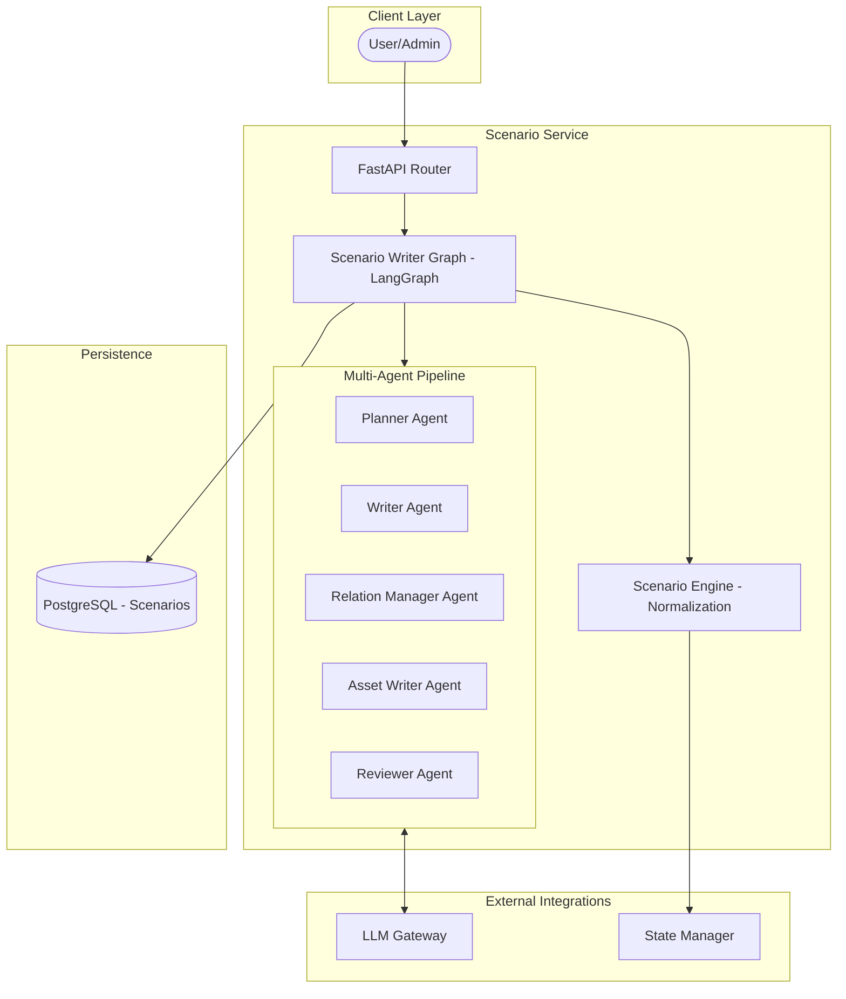
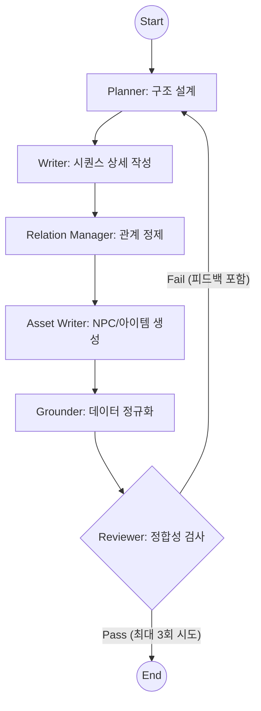

# Scenario Service Architecture

이 문서는 시나리오 서비스의 아키텍처 구조, 워크플로우 및 설계 장점을 설명합니다.

## 1. 아키텍처 구조도 (Architecture Diagram)

---

## 2. 전체 워크플로우 (Workflow)

시나리오 서비스는 **LangGraph** 기반의 에이전트 파이프라인(`ScenarioWriterGraph`)을 통해 시나리오를 생성하고 검증합니다.

### 2.1 LangGraph 노드 흐름도 (Self-Correction Loop)

### 2.2 상세 단계 설명

1.  **Planner (기획자)**: 사용자의 컨셉을 바탕으로 전체적인 Act와 Sequence 구조를 설계하고 목표(Goal)를 정의합니다.
2.  **Writer (작가)**: 기획된 구조를 바탕으로 각 시퀀스의 구체적인 지문과 엔티티 배치를 작성합니다.
3.  **Relation Manager (관계 관리자)**: Planner와 Writer가 제안한 엔티티 간의 관계를 게임 룰에 맞춰 엄격하게 정제하고 확정합니다.
4.  **Asset Writer (설정 담당)**: 시나리오와 각 시퀀스에서의 역할을 반영하여 NPC, 적(Enemy), 아이템(Item)의 상세 명세와 속성을 생성합니다.
5.  **Grounder (정규화)**: LLM이 생성한 불규칙한 ID나 포맷을 시스템 표준 규격(`clean_id` 등)으로 정규화합니다.
6.  **Reviewer (검수자)**: 생성된 데이터가 스키마를 준수하는지, 엔티티 참조 오류는 없는지 검사합니다. 결함 발견 시 피드백과 함께 Planner 단계로 되돌려 수정을 요청합니다.

---

## 3. 아키텍처의 장점

1.  **자가 수정 루프 (Self-Correction)**:
    *   Reviewer 에이전트가 생성물의 논리적 오류나 데이터 누락을 실시간으로 감지하고 수정 루프를 돌림으로써, 사람이 개입하지 않아도 높은 품질의 시나리오 데이터를 보장합니다.
2.  **구조적 정합성 보장 (Strict Schema)**:
    *   단순한 텍스트 생성이 아닌, State Manager가 즉시 로드할 수 있는 엄격한 JSON 스키마와 ID 체계(Scenario-specific ID)를 준수하여 시스템 간 호환성을 극대화합니다.
3.  **에이전트 전문화 (Specialized Agents)**:
    *   기획, 설정, 집필, 검수 역할을 분리하여 각 단계에 최적화된 프롬프트를 적용함으로써 전체적인 시나리오의 완성도와 일관성을 높입니다.
4.  **데이터 정규화 (Normalization Engine)**:
    *   LLM의 비결정적인 출력을 시스템이 이해할 수 있는 결정적인 데이터로 변환하는 별도의 엔진을 두어, 외부 모델의 변화에도 유연하게 대응할 수 있습니다.
5.  **유효성 가드레일 (Validation Guardrails)**:
    *   "전투 시퀀스에는 반드시 적이 포함되어야 한다"와 같은 게임 디자인 룰을 Reviewer 단계에서 강제하여 게임 플레이가 불가능한 시나리오 생성을 원천 차단합니다.
